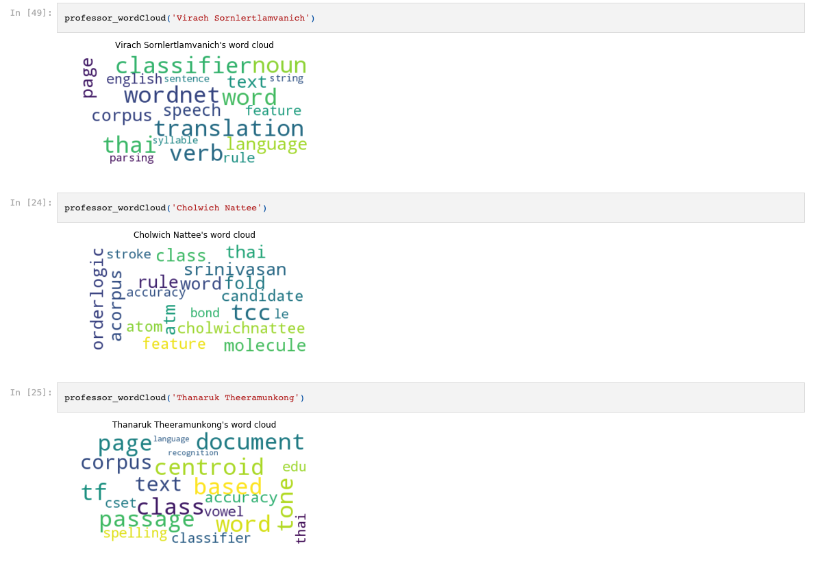

# ResearchPapersAnalyticsDemo  

Demonstration of what we can do with corpus of research papers.  

Research papers were collected crawling from google scholar using SIIT instructors names obtain from SIIT website. 

---

#### Files explanation  
siit_instructor_crawler: Get all of the SIIT instructor names from SIIT website and store in csv.  
gscholar_crawler.py: Crawl research paper in pdf from google scholar using SIIT staff info.  
Summary.ipynb: short version of everything.     

Paper Content Preprocessing.ipynb: Convert many pdfs into one .csv file.    
PdfPaper Analytics (Bag of Words): Using bag of words model to find similarity in research paper.   
Paper Analytics with tf-idf.ipynb: Using Tf-Idf to find similarity in research paper.  
Apply word2vec to papers.ipynb : Word2Vec implementation.  

#### Data

Our data has 784 papers and 5 columns.  
Each row in .csv represent on research paper. 

###### Column Information
Name: Author's name  
Content: content in papers extracted from pdf file  
Directory: directory of the paper pdf   
Faculty: Faculty that the professor is in

---

### Result

Summary: [[Link](Summary.iypng)]

TF-IDF wordcloud: [[Link](Paper%20Analytics%20with%20tf-idf.ipynb)]

